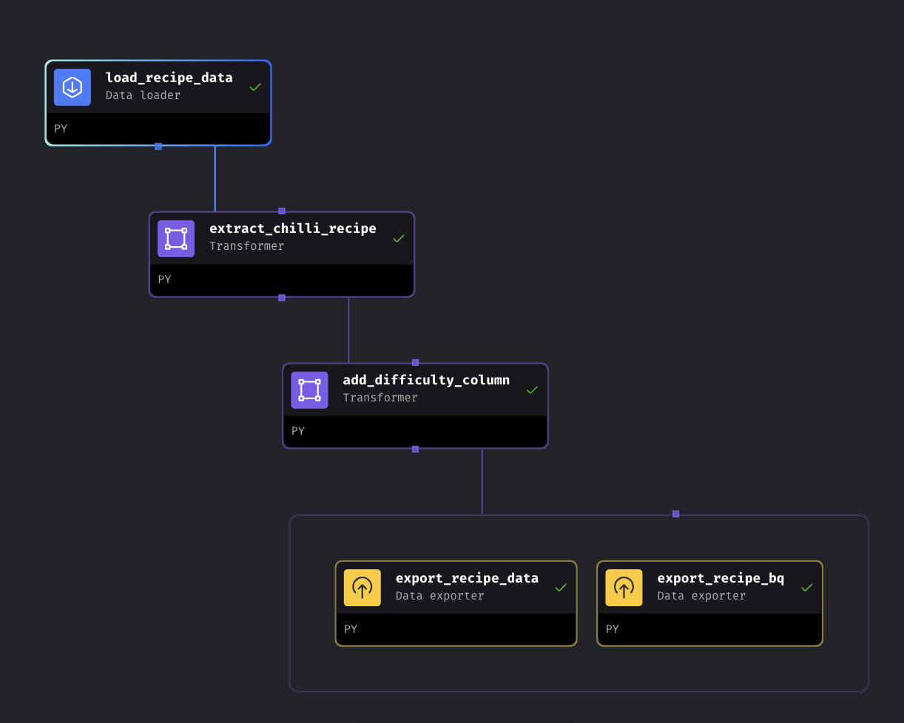
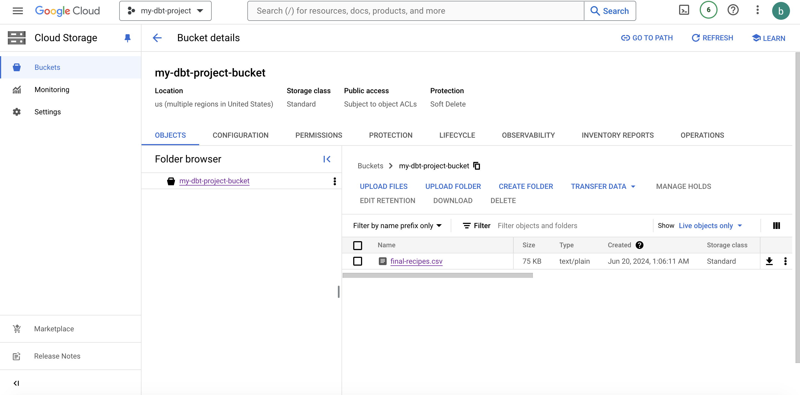
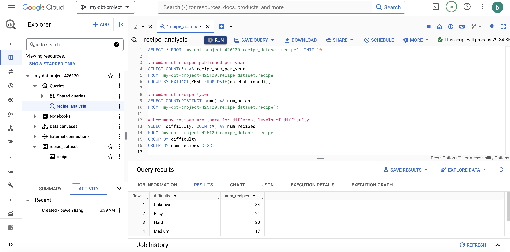

# Overview
We use two methods to perform the ETL of recipe data: one is through a Python script, and the other is by using various related tools to construct an orchestrated ETL pipeline.

## Python Scripts

This Python script downloads a JSON file containing recipes from a web URL, parses the data into a Pandas DataFrame, filters recipes based on ingredients containing specific keywords ('chilies', 'chiles', 'chili'), calculates the difficulty level of each recipe based on preparation and cooking times, and outputs the filtered recipes with difficulty levels to a CSV file.

### Requirements

- Python 3.11.5 or higher
- Required Python modules specified in requirements.txt

### Installation

1. Clone the repository using the following command:
```bash
git clone https://github.com/QzQz-2000/recipes-etl.git
cd recipes-etl
```

2. Install dependencies:

Create a virtual environment (optional but recommended):

```bash
python3 -m venv venv
source venv/bin/activate
```

Install required packages:

```bash
pip install -r requirements.txt
```

### Run the python script

Execute the python script:

```bash
python recipes_etl.py
```

## Orchestrated ETL pipeline

Now we can undertake an interesting experiment. Earlier, we implemented an ETL process using Python. We can now attempt to build a well-orchestrated ETL pipeline and upload the final CSV file to a cloud platform. This aims to streamline data processing workflows, ensure data integrity, and enable efficient analytics and reporting.

### Technologies used

- **Mage:**
  - Open-source data pipeline tool for transforming and integrating data.
- **Docker:**
  - Containerization platform for packaging applications and dependencies.
- **Terraform:**
  - Infrastructure as code (IaC) tool for provisioning and managing cloud resources.
- **Google Cloud Storage and BigQuery:**
  - Cloud storage and data warehousing solutions for storing and analyzing large datasets.

### Prerequisites

Before you can start working with this project, ensure you have the following prerequisites installed and set up:

1. **Google Cloud Platform (GCP) Account**

- You'll need a GCP account to use Google Cloud services such as Google Cloud Storage. If you don't have a GCP account, sign up for free [here](https://cloud.google.com/free).

2. **Terraform**

- Make sure you have installed Terraform, if not, follow the instructions [here](https://developer.hashicorp.com/terraform/install).
- Verify the installation by running `terraform --version` in your terminal.

3. **Docker**

- Install Docker Desktop for your operating system by following the instructions in the [official documentation](https://docs.docker.com/get-docker/).
- Verify Docker installation by running `docker --version` in your terminal.

4. **Mage**

- Install Mage by following the instructions in the [official documentation](https://docs.mage.ai/introduction/overview)

### Running the pipeline

After installing the prerequisites, follow these steps.

1. **Clone the Repository**: Clone this repository to your local machine using the following command:

  ```bash
  git clone https://github.com/QzQz-2000/recipes-etl.git
  cd recipes-etl
   ```

2. **Set Up GCP Authentication**: Configure authentication for Google Cloud Platform by following the instructions [here](https://cloud.google.com/docs/authentication/getting-started).

3. **Initialize Terraform**: We use terraform to create the bucket we need on Google Cloud Storage. Navigate to the `terraform` directory and initialize Terraform by running the following command:

   ```bash
   terraform init
   terraform plan
   terraform apply
   ```

4. **Start Mage**: Navigate to the `Mage` directory and start Mage by doing `docker-compose up`. The navigate to http://localhost:6789 in your browser to use Mage.

5. **Deploy the Data Pipeline**: Make sure to run the pipeline as follows:

   

6. Then in Google cloud Storage, navigate to your bucket. There you can see the uploaded CSV file. 

   

   In BigQuery you can see the `recipe` table we created in Mage. There we can do some SQL analysis. The query can be found here: [recipe_analysis_bigquery.sql](https://github.com/QzQz-2000/recipes-etl/blob/main/recipe_analysis_bigquery.sql)

   

### Mage Pipeline
#### Data loader
Load the recipe dataset from API: [load_recipe_data.py](https://github.com/QzQz-2000/recipes-etl/blob/main/mage/your_first_project/data_loaders/load_recipe_data.py)

#### Transformer
Extract the recipe of chillis: [extract_chilli_recipe.py](https://github.com/QzQz-2000/recipes-etl/blob/main/mage/your_first_project/transformers/extract_chilli_recipe.py)

Add 'difficulty' column to the data: [add_difficulty_column.py](https://github.com/QzQz-2000/recipes-etl/blob/main/mage/your_first_project/transformers/add_difficulty_column.py)

#### Data exporter
Export CSV data to Google Cloud Storage bucket: [export_recipe_data.py](https://github.com/QzQz-2000/recipes-etl/blob/main/mage/your_first_project/data_exporters/export_recipe_data.py)

Export CSV data to Google BigQuery: [export_recipe_bq.py](https://github.com/QzQz-2000/recipes-etl/blob/main/mage/your_first_project/data_exporters/export_recipe_bq.py)

## What can we do more?
1. We can introduce Apache Spark to significantly speed up data processing and utilize partitioning to store the data in Parquet format for improved query efficiency. For example, we can partition the recipe data by year. This is very useful for large datasets.
2. If we acquire more data in the future, we can utilize dbt to model the data by dividing it into dimension and fact tables, thereby constructing a star schema. Ultimately, we can import the data into Looker Studio for visualization.
3. Similarly, our solution can leverage AWS tools to achieve the same goals. We can use Amazon S3 for object storage services and Amazon Redshift to perform the functions of BigQuery.
4. We can also use Mage to add triggers to schedule our ETL pipeline and try to add CI/CD.
